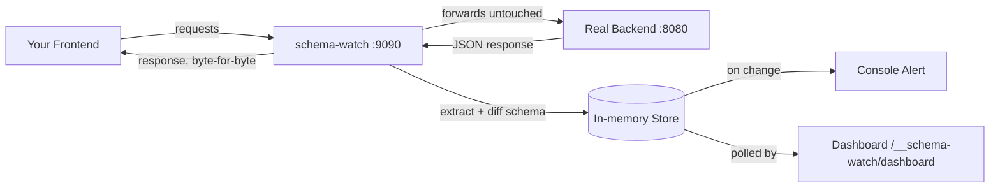

# schema-watch

A local reverse proxy that watches your API traffic and alerts you the moment
a JSON response's shape changes before it becomes a silent frontend bug.

## The Problem

Frontend and backend share an implicit contract: "this endpoint returns a
`user` object with `id: number`, `email: string`." Nobody writes that
contract down anywhere machine-checkable, it's just whatever the backend
happens to return today.

When someone renames a field, changes an `id` from an int to a UUID string,
or restructures a nested object, nothing breaks at the HTTP level. The
request still returns `200`. The frontend just starts getting `undefined`
where it expected a number, and the failure shows up far from its cause,
usually deep in state management, long after the actual change happened.

schema-watch exists to close that gap: it watches the real bytes crossing
the wire and tells you the instant they stop matching what they used to be.

## How It Works



Point your frontend at schema-watch instead of your real backend.
Every response that passes through gets its JSON shape extracted and
compared against the last shape seen for that endpoint. If they differ,
you get an alert in the console immediately, and on a live dashboard.
The client never sees a difference; schema-watch only observes.

## Features

- **Transparent proxying**: a drop-in replacement URL, zero changes to
  either side of your API.
- **Structural diffing**: detects fields added, removed, or changed type,
  independent of the actual values.
- **Breaking vs. additive**: a removed or type-changed field is flagged
  `BREAKING`; an added field is flagged as a lower-severity `CHANGE`.
- **Console + dashboard**: colored terminal output for live coding, plus a
  `/__schema-watch/dashboard` page showing every watched endpoint and its
  full diff history.
- **Configurable noise control**: ignore specific fields (e.g. `updated_at`)
  or whole endpoints (e.g. health checks) so volatile-but-harmless changes
  don't cry wolf.
- **Single binary**: the dashboard is embedded, no separate frontend build
  or asset pipeline required.

## Quick Start

**No Go installed? Download a binary, works with a backend in any language:**

Grab the file for your OS from the [Releases page](../../releases) and run
it. schema-watch doesn't care what your backend is written in Rust, Java,
C#, Python, whatever it only watches the JSON going over HTTP.

```bash
# macOS / Linux
./schema-watch --demo

# Windows
schema-watch-windows-amd64.exe --demo
```

**Have Go installed?**

```bash
go install github.com/Oliveszn/Schema-Watch@latest
schema-watch --demo
```

**Building from source:**

```bash
go mod tidy
go run main.go --demo          # zero-setup demo, no backend needed
go run main.go --target=http://localhost:8080 --port=9090   # your own backend
```

Whichever path you use: point your frontend at `http://localhost:9090`
instead of your backend, and open
`http://localhost:9090/__schema-watch/dashboard` to watch schema history
live.

## Configuration

Copy `config.example.yaml` to `config.yaml`:

```yaml
target: "http://localhost:8080"
port: "9090"

ignore_fields:
  - updated_at
  - created_at

ignore_endpoints:
  - "GET /health"
  - "GET /metrics*"
```

CLI flags override the config file, which overrides built-in defaults
(`http://localhost:8080` / port `9090`). `ignore_fields` matches by leaf
field name at any nesting depth one entry covers `updated_at`,
`user.updated_at`, `order.updated_at`, etc. `ignore_endpoints` supports an
exact match or a trailing `*` prefix wildcard.

## Project Structure

```
schema-watch/
├── main.go                   # wires config, store, proxy, alert, dashboard
├── internal/
│   ├── schema/                # JSON -> flattened Schema, and schema diffing
│   ├── store/                  # in-memory last-seen-schema + diff history
│   ├── proxy/                  # the reverse proxy itself
│   ├── alert/                  # colored console output
│   ├── config/                  # config.yaml loading + ignore-rule matching
│   └── dashboard/                # embedded HTML dashboard + JSON API
└── config.example.yaml
```

Each `internal/` package is independently unit tested `schema` and `store`
don't need a running server at all; `proxy` and `dashboard` are tested with
`httptest` fakes.

## Design Decisions & Tradeoffs

- **Flattened dot-paths over nested trees.** Schemas are stored as
  `map[string]FieldType` (e.g. `"user.address.city": "string"`) rather than
  nested structs. This turns diffing into a flat map comparison instead of
  recursive tree-diffing, simpler, and it's what makes the diff output
  readable as a flat list of changes.
- **`null` is its own type.** A field flipping from `null` to a real value
  registers as a type change. This is deliberate but can be noisy for
  genuinely nullable fields use `ignore_fields` for those.
- **Passive, not polling.** schema-watch only reacts to traffic that
  actually passes through it, it doesn't independently ping your backend
  on a timer. In an active dev workflow (frontend firing requests as you
  click around) this is nearly as good as real-time. It won't catch a
  change on an endpoint nobody hits.
- **Endpoints are keyed by literal path.** `/users/1` and `/users/2` are
  currently tracked as distinct endpoints, since there's no route-pattern
  awareness (no `/users/:id` normalization). Fine for a small, known set of
  endpoints; gets noisy on paths with many distinct IDs.

## Not for Production

This is a **local development tool**, not infrastructure. It buffers full
response bodies in memory on every request (no streaming), tracks every
literal path it sees forever with no eviction, and has no timeouts, TLS
handling, or failure isolation beyond what `httputil.ReverseProxy` gives for
free. None of that matters in dev, it matters a lot under real traffic.
Keep it strictly local/staging, in front of nothing that serves real users.

## Known Limitations / Future Work

- No path-parameter normalization (`/users/:id` instead of per-ID tracking).
- No active polling, passive traffic-observation only.
- No persistence across restarts, history is in-memory and resets when
  schema-watch restarts.
- Console/dashboard alerting only, no webhook/Slack integration.
- Single backend target, proxying multiple microservices means running
  multiple schema-watch instances, one per target.

## Testing

```bash
go test ./...
go test -race ./...   # the store and proxy are hit from concurrent requests
```

## License

MIT — see [LICENSE](LICENSE).
